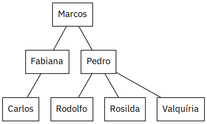

# Árvores genéricas para apresentação das ASTs

- Vamos adicionar um mecanismo ao compilador que vai permitir exibir árvores de sintaxe de forma mais amigável.

- O desenvolvimento aqui descrito corresponde à versão [v0.3](https://github.com/romildo/bcc328.2020.3/releases/tag/v0.3) do compilador.

## Módulos auxiliares

- `Util`: funções de utilidade geral.

- `Box`: _caixas_ de texto que podem ser combinados de diferentes maneiras.

## Árvores genéricas

- Uma árvore não vazia é representada por uma informação (**raiz**) e por uma lista de sub-árvores.

- Módulo `Tree`:
  - `'a tree`: tipo das árvores cujos elementos são do tipo indicado pela variável de tipo `'a`.
  - `mkt raiz sub_arvores`: constrói uma árvore com a raiz e as sub-árvores indicadas.
  - `map funcao arvore`: aplicada a função dada a cada nó da árvore retornando uma árvore com os resultados.
  - `string_of_tree arvore`: converte a árvore para string
  - `box_of_tree arvore`: faz a diagramação de uma árvore de strings em duas dimensões na forma de um _box_.
  - `dot_of_tree nome arvore`: converte uma árvore de strings para um grafo expresso na linguagem `dot` com o nome dado.

- Exemplo:
  ``` ocaml
  open Tree
  let t = mkt "Marcos"
               [ mkt "Fabiana"
                     [ mkt "Carlos" [] ];
                 mkt "Pedro"
                     [ mkt "Rodolfo" [];
                       mkt "Rosilda" [];
                       mkt "Valquíria" []
                     ]
               ]
  
  let _ =
    print_endline (string_of_tree t);
    print_endline (Box.string_of_box (box_of_tree t));
    let dot_channel = open_out "exemplo.dot" in
    output_string dot_channel (dot_of_tree "AST" t)
    ```
  resulta em
  ```
  Marcos
  ├─ Fabiana
  │  └─ Carlos
  └─ Pedro
     ├─ Rodolfo
     ├─ Rosilda
     └─ Valquíria
                  ╭──────╮                 
                  │Marcos│                 
                  ╰───┬──╯                 
      ╭───────────────┴────╮               
  ╭───┴───╮             ╭──┴──╮            
  │Fabiana│             │Pedro│            
  ╰───┬───╯             ╰──┬──╯            
  ╭───┴──╮      ╭─────────┬┴─────────╮     
  │Carlos│  ╭───┴───╮ ╭───┴───╮ ╭────┴────╮
  ╰──────╯  │Rodolfo│ │Rosilda│ │Valquíria│
            ╰───────╯ ╰───────╯ ╰─────────╯
    ```
  O arquivo dot gerado pode ser convertido para uma imagem:
  ```
  $ dot -Tpng exemplo.dot > exemplo.dot.png
  ```
  

## Convertendo árvores sintáticas para árvores genéricas

- As árvores genéricas serão usadas para melhor visualização das árvores de sintaxe.

- Módulo `Absyntree`: converter as árvores de sintaxe para árvores genéricas.
  ``` ocaml
  (* Convert abstract syntax trees to generic trees of list of string *)
  
  open Absyn
  
  (* Helper functions *)
  
  (* Format arguments according to a format string resulting in a string *)
  let sprintf = Format.sprintf
  
  (* Concatenate the lines of text in the node *)
  let flat_nodes tree =
    Tree.map (String.concat "\n") tree
  
  (* Build a singleton tree from a string *)
  let mktr s = Tree.mkt [s]
  
  
  (* Convert an expression to a generic tree *)
  let rec tree_of_exp exp =
    match exp with
    | BoolExp x                 -> mktr (sprintf "BoolExp %b" x) []
    | IntExp x                  -> mktr (sprintf "IntExp %i" x) []
    | RealExp x                 -> mktr (sprintf "RealExp %f" x) []
    | WhileExp (t, b)           -> mktr "WhileExp" [tree_of_lexp t; tree_of_lexp b]
    | BreakExp                  -> mktr "BreakExp" []
  
  (* Convert an anotated expression to a generic tree *)
  and tree_of_lexp (_, x) = tree_of_exp x
    ```

- Exemplos usando o ambiente interativo (**_toplevel_**):
  ``` ocaml
  # let texto = Format.sprintf "adição: %i + %i = %i" 2 5 (2 + 5);;
  val texto : string = "adição: 2 + 5 = 7"

  # let t1 = Tree.mkt ["bom"; "dia"; "brasil"] [];;
  val t1 : string list Tree.tree = Tree.Tree (["bom"; "dia"; "brasil"], [])

  # let t2 = Absyntree.flat_nodes t1;;
  val t2 : string Tree.tree = Tree.Tree ("bom\ndia\nbrasil", [])

  # let t3 = Absyntree.mktr "raiz" [Absyntree.mktr "filho" []];;
  val t3 : string list Tree.tree =
    Tree.Tree (["raiz"], [Tree.Tree (["filho"], [])])

  # let t4 = Absyntree.tree_of_exp (IntExp 18);;
  val t4 : string list Tree.tree = Tree.Tree (["IntExp 18"], [])
  ```

- Dica: para executar o ambiente interativo **utop** carregando os módulos do projeto:
  ```
  $ dune utop
  ```

## Imprimindo a árvore sintática

- Para exibir a árvore sintática na saída padrão do compilador:
  1. converter para uma árvore genérica
  2. converter a árvore genérica para uma string usando uma das funções de conversão
  3. imprimir a string

- Por ora vamos exibir na forma de um grafo bidimensional.

- No módulo `Driver` temos até agora:
  ``` ocaml
  let ast = Parser.program Lexer.token lexbuf in
  Format.printf "%s\n" (Absyn.show_lexp ast)
  ```

- Vamos substituir por:
  ``` ocaml
  let ast = Parser.program Lexer.token lexbuf in
  print_endline "Abstract syntax tree:";
  print_endline "============================================================";
  let tree = Absyntree.flat_nodes (Absyntree.tree_of_lexp ast) in
  let boxtree = Tree.box_of_tree tree in
  print_endline (Box.string_of_box boxtree)
  ```

## Testando o novo driver

- Exemplo de execução do compilador depois das alterações:
  ```
  $ dune exec src/driver/driver.exe
  while true do
    while false do
      56.7
  Abstract syntax tree:
  ============================================================
                      ╭────────╮                    
                      │WhileExp│                    
                      ╰────┬───╯                    
         ╭─────────────────┴──────╮                 
  ╭──────┴─────╮             ╭────┴───╮             
  │BoolExp true│             │WhileExp│             
  ╰────────────╯             ╰────┬───╯             
                        ╭─────────┴───────╮         
                 ╭──────┴──────╮ ╭────────┴────────╮
                 │BoolExp false│ │RealExp 56.700000│
                 ╰─────────────╯ ╰─────────────────╯
    ```

## Tarefas para conclusão do analisador sintático

- Para cada **construção da linguagem** que for adicionada ao analisador sintático:
  1. Definir a **representação da árvore sintática** (módulo `Absyn`)
  2. Definir a regra de como converter a árvore sintática para **árvore genérica** (módulo `Absyntree`)
  3. Definir as **regras de produção** na gramática (módulo `Parser`
  4. Se necessário, definir as **regras léxicas** para os novos tokens (módulo `Lexer`)
  5. **Testar**

- Ficará faltando ainda definir o módulo de testes, que será assunto de outra aula.

- A partir deste ponto os alunos já podem começar a implementar estas tarefas.

- Não esquecer de:
  - Abrir uma **_issue_** para dizer que tarefa será implementada. Use este espaço para discutir detalhes preliminares da implementação.
  - Marcar em `TODO.md` as tarefas que estão sendo implementadas.
